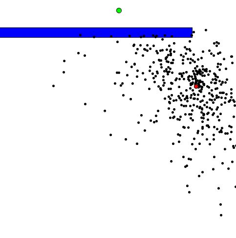

# Evolution

Implementing a genetic algorithm for finding the shortest path in a simple maze.
Each little dot has a genome which determines the way of its movement in 500 frames.

After the simulation, each Dot is given a fitness value (calculated by the minimum distance from the goal), and the least suitable ones are replaced by the children of two more successful Dots.
After the crossover, the entire population mutates, giving the necessary random factor to improve the path.

Example frame from an evolution process:

